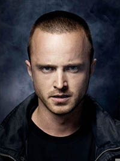
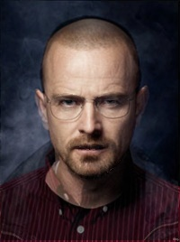

# Server-side Face Morphing Engine

## SERVER (C++)

A server-side face morphing engine implementation by Delaunay Triangulation based in C++ with [OpenFace](https://github.com/TadasBaltrusaitis/OpenFace), [OpenCV](https://github.com/opencv/opencv), and [BOOST](https://github.com/boostorg/). 

Any clients which can send a http-request (with two images basically) could receive the morphed face as a result.

This project first started as a forked project from [HERE](https://github.com/DevendraPratapYadav/FaceMorphing), then manipluated to the server-based application (via TCP/IP socket communication) powered by Face Detection library included in OpenFace and image processing & computer vision libraries in OpenCV.

This has been adopted & being used to a face-morphing baed commercial quiz service, with reasonably fast speed and quality.

### DEPENDENCIES

- OpenFace for Face Detection (FD) & Face Landmark Detection (FLD)
- BOOST for TCP/IP communication w/ some utilities
- OPENCV 3.1 for image processing
- TBB as it's dependent to the OpenFace project
- CMAKE >= 2.8 to compile

### SUPPORTED TYPES OF MORPHING

#### 1. Composable-type Morphing

#### 2. Progressive-type Morphing

### Usage

```
$ ./face-morph-server 9876 .
```

## CLIENT (PHP)

A FLDM (Face Landmark Detection & Morphing) client script, which queries TCP-request to the FLDM server which performs the "face morphing" task to the given images (source and destination) in the command-line shell using PHP script.

### Usage
```
$ /usr/bin/php fldm-client.php ../../sample/1.jpg ../../sample/2.jpg composable 5
```

## Sample Result
The sample images below has been derived from the forked project done by DevendraPratapYadav.

### Source


### Destination


### Result

